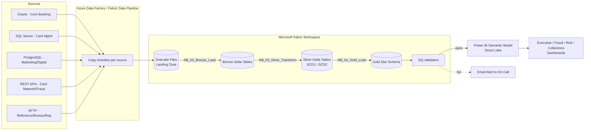

# UK Credit Card Data Platform — Architecture Guide

## 1. End-to-End Flow

## 2. Medallion Architecture Rationale

| Layer | Format | Grain | Retention | Purpose |
|---|---|---|---|---|
| Landing (Files) | Delta (unmanaged) | 1:1 with source extract | 30 days | Raw immutable copy of what was extracted, for replay/audit |
| Bronze | Managed Delta table | 1:1 with source, append-only | 7 years (FCA record-keeping) | Full history of every batch received, partitioned by `batch_id` |
| Silver | Managed Delta table | Cleansed business entity, SCD1/SCD2 | 7 years | Single conformed version of each entity, deduplicated, typed, validated |
| Gold | Managed Delta table, Star Schema | Fact/Dim, surrogate keys | 7 years | Business-consumable model for Power BI / ad-hoc SQL |

**Why Delta everywhere (not Parquet/CSV in Bronze)?** ACID MERGE support is
required from the very first landing point because several source systems
(Card Mgmt, Collections) send corrective re-deliveries, not just new rows;
Parquet/CSV would force a separate reconciliation step.

**Why SCD2 for `customer`, `account`, `credit_card`, `credit_limit`,
`card_product`, `branch`, `customer_risk_profile`, but SCD1 for
`merchant`?** Anything that feeds an affordability, credit-limit, or
risk-grade decision must be point-in-time queryable for FCA/PRA audit
("what did we know about this customer when we approved this
transaction?"). Merchant attributes have no regulatory history
requirement, so SCD1 keeps storage and MERGE cost down.

## 3. Security Architecture

- **Workspace-level RBAC**: Admin / Member / Contributor / Viewer roles per
  Fabric workspace; Bronze/Silver restricted to Data Engineering, Gold open
  to Analytics + BI.
- **Row-Level Security (RLS)** on the Power BI semantic model: Relationship
  Managers see only their `branch_id`; Collections agents see only their
  assigned accounts.
- **Column-level masking**: `national_insurance_no`, `card_number_masked`,
  `card_token` are never exposed unmasked outside Bronze; Silver/Gold carry
  only masked/tokenised forms (PCI-DSS scope reduction).
- **OneLake data access roles** restrict Files/Bronze access to service
  principals used by the pipeline; interactive users only ever query
  Silver/Gold via the SQL Analytics Endpoint or Power BI.
- **Encryption**: OneLake encrypts at rest by default (Microsoft-managed
  keys, customer-managed key option for regulated workloads); TLS 1.2+ in
  transit for all ADF Copy Activities and API calls.

## 4. Monitoring & Observability

- `dbo.pipeline_execution_log` — every notebook run, every table, START/
  SUCCESS/FAILED with row counts and duration (see `NB_Utilities_Common`).
- `dbo.dq_validation_summary` — referential integrity + threshold results
  per batch, written by `NB_05_Data_Quality_Validation`.
- `dbo.dq_quarantine_<table>` — rejected rows per table (missing PK etc.).
- Fabric native monitoring hub + Capacity Metrics app for Spark job/CU
  consumption; alerting via the pipeline's `WEB_Send_Failure_Alert` activity
  (Teams/Email webhook) on any activity failure.

## 5. CI/CD & Environments

- Git integration (this repository) is the source of truth; Fabric
  Deployment Pipelines promote Dev → Test → Prod workspaces.
- `metadata/table_config.json` is environment-agnostic; only connection
  strings / capacity IDs differ per stage (managed via Fabric deployment
  rules, not code changes).
- Notebook parameters (`batch_id`, `ingestion_date`, `source_system`,
  `table_name`) are always externally injected by the pipeline — never
  hardcoded — so the same notebook artifact is promoted unchanged across
  environments.

## 6. Disaster Recovery / High Availability

- OneLake storage is geo-redundant (GRS) by default at the Fabric capacity
  region's paired region.
- Delta transaction log + time travel gives point-in-time recoverability
  for accidental bad writes (`RESTORE TABLE ... TO VERSION AS OF`).
- Pipeline is idempotent per `batch_id` (Bronze append is deduped by
  `record_hash`; Silver MERGE is upsert-safe) — a failed run can always be
  safely re-triggered for the same `batch_id`.
- RTO target: 4 hours (re-run pipeline from last successful batch_id).
  RPO target: 24 hours (daily batch cadence); can be tightened with
  intraday micro-batches if the bank moves to near-real-time fraud
  scoring.
